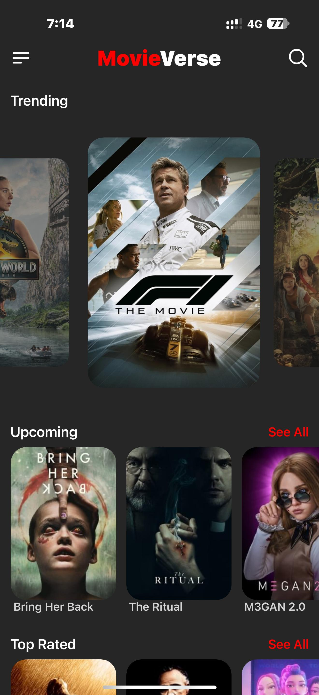
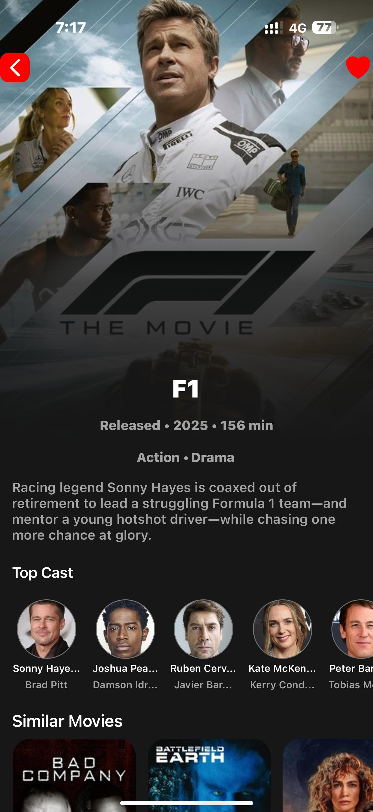
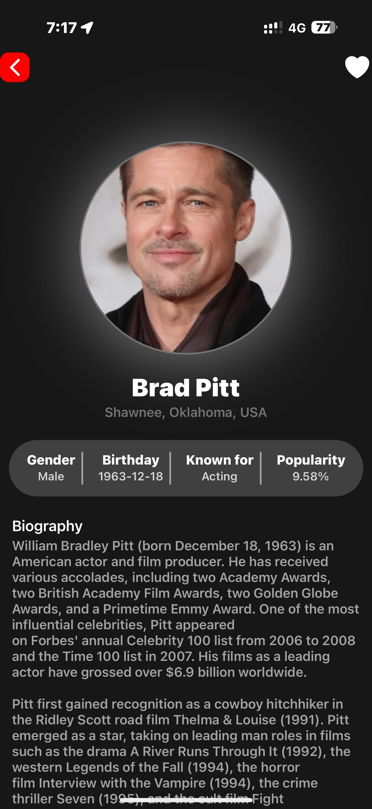
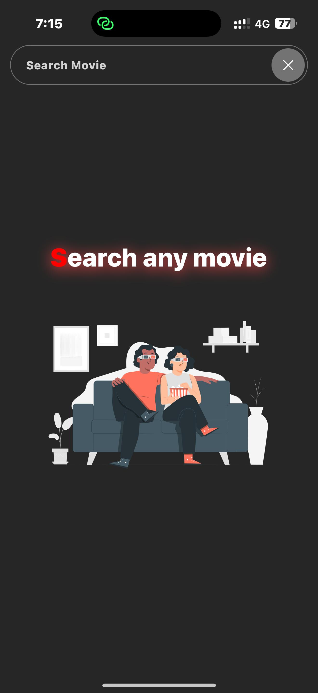
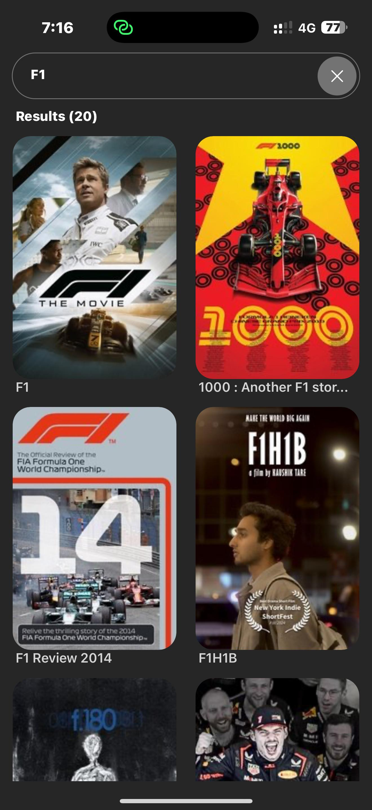
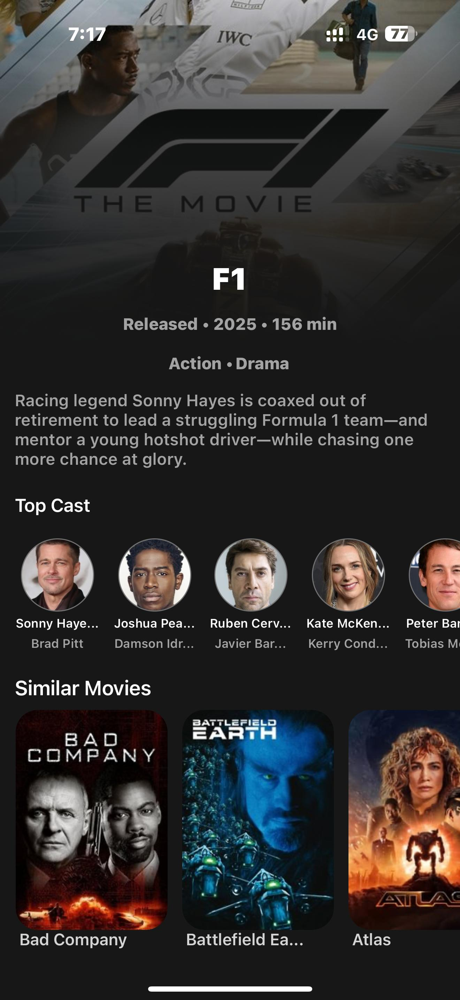
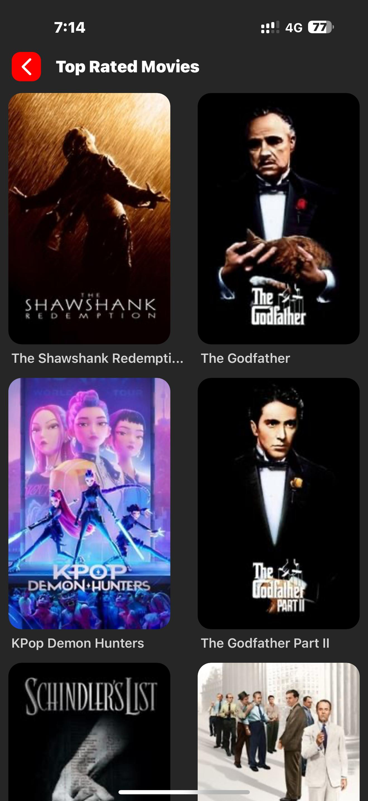
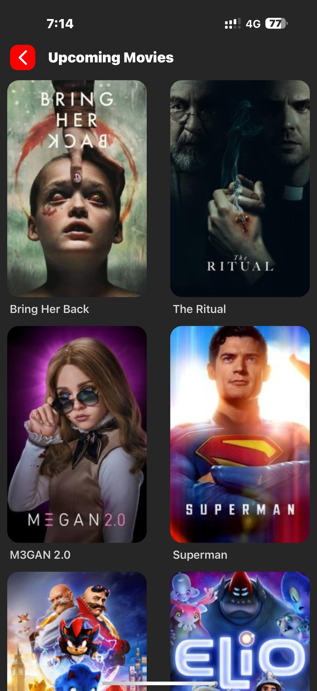
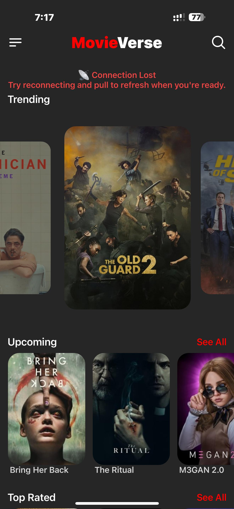

# 🎬 MovieVerse

Welcome to **MovieVerse** – your one-stop mobile app to explore trending movies, detailed cast information, and personalized recommendations. Built with **React Native**, this app brings the magic of cinema to your fingertips.

<p align="center">
  
</p>

---

## 📱 Features

- 🔥 **Trending Carousel** – Discover what’s hot in theaters and on streaming.
- 🎭 **Detailed Movie Pages** – Dive into synopses, cast details, and ratings.
- 🎥 **Cast & Crew Profiles** – Learn more about your favorite actors and directors.
- 🤖 **Personalized Suggestions** – Get smart movie recommendations.
- 🌙 **Dark Mode Support** – Enjoy the app in your preferred theme.

---

## 🧰 Tech Stack

| Category           | Technologies Used                      |
|-------------------|-----------------------------------------|
| Frontend          | React Native, NativeWind, Expo          |
| Backend/API       | TMDb API (The Movie Database)           |
| State Management  | React Redux                             |
| Styling           | Tailwind CSS (via NativeWind)           |
| DevOps            | EAS Build, GitHub                       |
| Version Control   | Git, GitHub                             |

---

## 🖼️ App Screenshots

### 🏠 Home Screen


### 🎬 Movie Details


### 👤 Person Details


### 🔍 Search Movie


### 📄 Search Results


### 🎞️ Similar Movies


### ⭐ Top Rated Movies


### 📆 Upcoming Movies


### ⚠️ Error Message


---

## 🚀 Getting Started

### Prerequisites

- Node.js ≥ 16
- Expo CLI `npm install -g expo-cli`
- TMDb API Key (Get it from https://www.themoviedb.org/)

### Installation

```bash
git clone https://github.com/your-username/movieverse.git
cd movieverse
npm install
